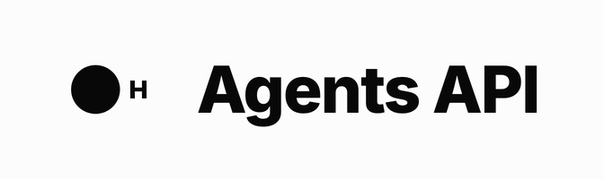

<p align="center">
  <picture>
    <source media="(prefers-color-scheme: dark)" srcset="assets/banner-dark.gif" />
    
  </picture>
</p>

<p align="center">
  <a href="https://hub.hcompany.ai/agents-api/introduction"></a>
  <a href="https://pypi.org/project/hai-agents/"></a>
  <a href="LICENSE.txt"></a>
</p>

<p align="center">
  Use cases and integrations for <a href="https://hcompany.ai">H Company</a>'s <a href="https://hub.hcompany.ai/agents-api/introduction">Agents API</a>, built on the <code>hai-agents</code> SDK.
</p>

<p align="center">
  <b><a href="https://hub.hcompany.ai/agents-api/introduction">Documentation</a></b>
  &nbsp;·&nbsp;
  <a href="https://platform.hcompany.ai/settings/api-keys">Get an API key</a>
  &nbsp;·&nbsp;
  <a href="https://github.com/hcompai/hai-agents-python">Python SDK</a>
  &nbsp;·&nbsp;
  <a href="https://github.com/hcompai/hai-agents-ts">TypeScript SDK</a>
  &nbsp;·&nbsp;
  <a href="https://hcompany.ai">H Company</a>
</p>

Build with H's Agents API, powered by our harness and [VLM](https://hcompany.ai/holo3.1). A Computer-Use Agent sees the screen and decides what to click, type, and scroll, just like a person would. You describe a task in plain language; H provisions the environment, runs the agent, and returns the result. It's the way in when the work lives behind a UI with no API to call.

The `hai-agents` SDK gives you programmatic access to our agents from a few lines of [Python](https://pypi.org/project/hai-agents/) or [TypeScript](https://npmjs.com/package/hai-agents).

This repo is a tour of three ways to build with the SDK, from a one-line prompt to production integrations:

1. **Discover.** Describe a task in plain language and watch the agent run it.
2. **Build with the skill** Let the `/hai-agents` skill scaffold reusable SDK code for you.
3. **Integrate** Call the agent as an MCP tool from your coding workflow (Claude Code, Hermes Agent, Codex, NemoClaw).

## Quickstart

```bash
git clone https://github.com/hcompai/agents-api-demos.git
cd agents-api-demos
uv sync
cp .env.example .env   # add your HAI_API_KEY from https://platform.hcompany.ai/settings/api-keys
```

## 1. Discover

Use the SDK directly. The example below is a single Python file: a few lines of the `hai-agents` SDK wrapped around a plain-language prompt. You write the prompt, the SDK runs the agent, and you've seen a CU agent in action.

> Just describe the task in plain language and let the agent run it:

```text
"Searches for "Random Access Memories" by Daft Punk on Amazon, adds it to the shopping cart."
```

https://github.com/user-attachments/assets/aa7473f8-9666-4640-ac34-6255ab67aa6d

→ Runnable code: [`examples/add_to_cart/add_to_cart.py`](examples/add_to_cart/add_to_cart.py) (Python)

## 2. Build with the skill

The [`/hai-agents`](skills/hai-agents) skill plugs into your coding agent and carries everything it needs to write SDK code for you: the full API knowledge, the auth and connection patterns, and enough context to write working SDK code quickly, in Python or TypeScript. You get a packaged expert writing your custom code, and an artifact you can deploy anywhere Python or Node runs, independent of the coding agent that scaffolded it. Iterate on prompts to grow your CU agent library.

This repo also doubles as a [Claude Code plugin marketplace](skills/README.md), so you can install the skill into your own Claude Code without cloning anything:

```
/plugin marketplace add hcompai/agents-api-demos
/plugin install hai-agents@hai-skills
```

> Ask the skill to write the SDK code, and it scaffolds a ready-to-run script:

```text
"/hai-agents:hai-agents Generate TypeScript code that navigates to jacquemus.com, searches for the France Jacquemus × Nike football jersey, checks its availability in sizes S and XXL, and reports the results clearly."
```

https://github.com/user-attachments/assets/d7d82573-22bb-4e2a-a261-bb603bc576f3

→ Generated code: [`examples/product_availability/src/index.ts`](examples/product_availability/src/index.ts) (TypeScript)

For deeper SDK patterns beyond what the skill scaffolds (custom tools, `max_steps` / `max_time_s` budgets, exhaustive sweeps), see [`examples/counterfeit_detection`](examples/counterfeit_detection/README.md).

## 3. Integrate

Now put the agent where you already work. MCP turns it into a first-class tool inside your coding workflow, Claude Code below, plus Hermes, Codex, NemoClaw, or anything that speaks MCP. One agent, many hosts, wiring is the only difference.

Example with Claude Code:

> *"Use `review_web_ui` to check https://news.ycombinator.com and verify the top story link works and the page has reasonable accessibility."*

https://github.com/user-attachments/assets/f0097089-033b-458b-8e20-2b59cc48b3a0

### Other hosts

- **Claude Code** (Anthropic). The MCP server is auto-registered from [`.mcp.json`](.mcp.json) when you open the repo, so the agent's tools are available the moment you run `claude`.
- **Hermes Agent** (Nous Research). Consumes the same MCP servers, skills, and CLIs. See [`hermes/`](hermes/) for the one-time setup.
- **Codex** (OpenAI). Same servers in `config.toml` form; the hosted platform server uses `bearer_token_env_var`. Watch Codex's 60 s default tool timeout. See [`codex/`](codex/).
- **NemoClaw** (HAI x NVIDIA x Hermes). A security runtime for regulated, sandboxed deployments, not another MCP host. It builds an NVIDIA OpenShell sandbox and runs Hermes inside it under a network-egress policy. The wiring is the Hermes integration plus an egress policy that lets the agent reach H's hosted server. See [`nemoclaw/`](nemoclaw/).

### Recipes

| Example | What it shows | Interface |
| --- | --- | --- |
| [`qa/mcp`](examples/qa/mcp/README.md) | Autonomous browser agent QAs a remote URL and returns structured `{verdict, summary, findings}` | MCP server (`review_web_ui`, `visual_check`) |
| [`qa/cli`](examples/qa/cli/README.md) | Same QA agent exposed as a shell command, surfaced to coding agents via the `hai-qa-via-cli` skill | CLI (`qa-cli review / visual`) |
| [`extract_anything`](examples/extract_anything/README.md) | Wrap an agent call as a typed Python function (generic `extract(url, task, schema)` or curated `get_*` tools), exposed as both MCP and CLI | MCP server (`extract`) + CLI (`extract-cli`) |

See [`examples/`](examples/README.md) for the full index and shared architecture.

## Configuration

| Env var | Required | Source |
| --- | --- | --- |
| `HAI_API_KEY` | yes | auto-setup via `python3 skills/hai-agents/scripts/h_login.py`, or manually from https://platform.hcompany.ai/settings/api-keys |

The hosted `hai-agents-platform` server in [`.mcp.json`](.mcp.json) (the generic platform MCP, for any H agent) is HTTP, not stdio, so it can't read `.env` like the others: Claude Code expands `${HAI_API_KEY}` in its auth header from the environment. Export the key before launching (`export HAI_API_KEY=hk-...`). It uses the EU endpoint (the demos' default); swap to `agp.hcompany.ai` for US.

## Project layout

```
agents-api-demos/
├── examples/    qa · extract_anything · counterfeit_detection · add_to_cart · product_availability (+ _shared.py helpers)
├── skills/      /hai-agents · /hai-qa-via-cli skills for your coding agent
├── hermes/      run the same demos in Hermes Agent (config + setup guide)
├── codex/       run the same demos in OpenAI Codex (config.toml + setup guide)
├── nemoclaw/    deploy the Hermes integration inside NVIDIA NemoClaw's sandbox (egress policy + image + guide)
├── .mcp.json    registers the MCP servers with Claude Code
├── .claude-plugin/marketplace.json
└── pyproject.toml · AGENTS.md
```

## Installation alternatives

Quickstart uses `uv sync`. If you prefer pip, the same packages are in `pyproject.toml`:

```bash
python -m venv .venv && source .venv/bin/activate
pip install -e .                   # editable install of this repo's deps
qa-cli review --url ...            # console scripts are on PATH inside the venv
```

The `.mcp.json` registration assumes `uv run` is available. If you go the pip route, edit `.mcp.json` to invoke the console scripts directly (drop the `uv run --env-file .env` prefix and `source .venv/bin/activate` beforehand, or pass the venv's interpreter explicitly).

## Links

- [Agents API documentation](https://hub.hcompany.ai/agents-api/introduction)
- [hai-agents on PyPI](https://pypi.org/project/hai-agents/)
- [hai-agents on Npm](https://npmjs.com/package/hai-agents)
- [H Company Platform](https://platform.hcompany.ai)
- [Model Context Protocol](https://modelcontextprotocol.io)

## License

[MIT](LICENSE.txt) © H Company
