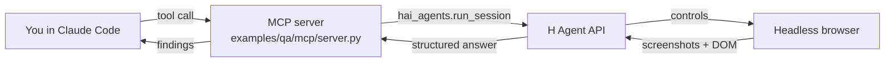

# hai-agent-demos

Recipes for the [`hai-agents`](https://pypi.org/project/hai-agents/) Python SDK, wired up as **MCP servers and CLI tools for Claude Code**, and runnable in [Hermes Agent](hermes/) too. Each example shows one way to use the SDK in a real workflow.

## What is this?

The `hai-agents` SDK lets you spin up autonomous agents — web-surfing, code-running, vision-capable — and drive them from Python. This repo wraps that SDK into two interface patterns so you can call the agents from inside Claude Code while you work:

- **MCP server** — Claude Code calls the agent like any other MCP tool
- **CLI + Claude Code skill** — Claude Code runs a shell command that the `hai-qa-via-cli` skill knows how to invoke

Each example also demonstrates a different *recipe* on top of the SDK:

- [`qa`](examples/qa/) ([`mcp`](examples/qa/mcp/) / [`cli`](examples/qa/cli/)): **single-task pattern** — wrap one agent task as one tool/command, exposed both as an MCP server and a CLI.
- [`extract_anything`](examples/extract_anything/): **bring-your-own-schema pattern** — one MCP tool (and matching CLI) that takes a URL plus a caller-supplied JSON Schema and returns matching JSON.
- [`counterfeit_detection`](examples/counterfeit_detection/): **single-agent + custom-tools pattern** — upgrade one agent with local Python tools (Playwright screenshots, Holo visual compare) and a step/time budget, no orchestration.

## Quickstart

```bash
git clone <this-repo>
cd hai-agent-demos
uv sync                                          # or: pip install -e . (see below)
cp .env.example .env  # add your HAI_API_KEY from https://platform.hcompany.ai/settings/api-keys
claude                 # opens Claude Code in the repo; the MCP server is auto-registered
```

In Claude Code:

> *"Use `review_web_ui` to check https://news.ycombinator.com — verify the top story link works and the page has reasonable accessibility."*

### Run in Hermes Agent (Nous Research)

These demos aren't limited to Claude Code. Hermes Agent consumes the same MCP servers, agentskills.io skills, and CLIs, so the SDK code is unchanged and only the host wiring differs. See [`hermes/`](hermes/) for the one-time setup (a config block plus a tool-call timeout bump).

### Installing the dependencies

The repo ships both a `pyproject.toml` (source of truth for dependencies, dev tools, and console scripts) and a `uv.lock` (pinned versions for reproducible installs). Use either tool — both pull the same packages from the same manifest.

**uv (recommended)** — fast, uses the lockfile, manages the virtualenv for you:

```bash
uv sync                            # installs runtime + dev deps into .venv/
uv run qa-cli review --url ...     # runs the console script in the env
```

**pip + venv** — same packages, no lockfile pin:

```bash
python -m venv .venv && source .venv/bin/activate
pip install -e .                   # editable install of this repo's deps
qa-cli review --url ...            # console scripts are on PATH inside the venv
```

The `.mcp.json` registration assumes `uv run` is available — if you go the pip route, edit `.mcp.json` to invoke the console scripts directly (drop the `uv run --env-file .env` prefix and `source .venv/bin/activate` beforehand, or pass the venv's interpreter explicitly).

## Examples

| Example | What it shows | Interface |
| --- | --- | --- |
| [`qa/mcp`](examples/qa/mcp/) | Autonomous browser agent QAs a remote URL and returns structured `{verdict, summary, findings}` | MCP server (`review_web_ui`, `visual_check`) |
| [`qa/cli`](examples/qa/cli/) | Same QA agent exposed as a shell command, surfaced to Claude Code via the `hai-qa-via-cli` skill | CLI (`qa-cli review / visual`) |
| [`extract_anything`](examples/extract_anything/) | One MCP tool (and matching CLI) that takes a URL, a task, and a caller-supplied JSON Schema; a cloud browser agent drives the page and returns JSON matching the schema. Demoed against Wikipedia's Picture of the Day — describing the featured image by actually looking at the pixels, which no scraper can do | MCP server (`extract`) + CLI (`extract-cli picture`) |
| [`counterfeit_detection`](examples/counterfeit_detection/) | Three-stage cookbook: a bare `run_session` finds one counterfeit of a genuine product; local custom tools add screenshot-grounded visual verdicts; a `max_steps`/`max_time_s` budget turns it into an exhaustive sweep | CLI (`counterfeit-cli simple / tooled / sweep`) |

## How it works



The MCP server is a thin FastMCP wrapper around `hai_agents.run_session`. Each tool defines an inline agent (with a browser environment and shared skills), submits the user's instruction, and surfaces the structured answer back to Claude Code.

Generic helpers (browser env, API-key check, logging/printing utilities) live in [`examples/_shared.py`](examples/_shared.py). QA-specific bits (the reviewer instructions, `ReviewResult` model, agent-skill loader) live in [`examples/qa/shared.py`](examples/qa/shared.py) and are imported by both `examples/qa/mcp` and `examples/qa/cli`.

## Configuration

| Env var | Required | Source |
| --- | --- | --- |
| `HAI_API_KEY` | yes | auto-setup via `python3 skills/hai-platform/scripts/h_login.py`, or manually from https://platform.hcompany.ai/settings/api-keys |

The [`counterfeit_detection`](examples/counterfeit_detection/) example additionally renders pages locally with Playwright; one-time setup:

```bash
uv run playwright install chromium
```

## Skills & plugin marketplace

This repo doubles as a **Claude Code plugin marketplace** ([`.claude-plugin/marketplace.json`](.claude-plugin/marketplace.json)): each skill is published as a plugin under the `hai-skills` marketplace, so anyone can install them into their own Claude Code without cloning the repo.

### Available skills

| Skill | What Claude learns | Pairs with |
| --- | --- | --- |
| [`hai-platform`](skills/hai-platform/) | The H Company APIs end-to-end: portal (auth, orgs, API keys + the automated `HAI_API_KEY` → `.env` login script), agent platform v2 (sessions, agents, environments, vaults, long-polling), the hai-agents Python/TS SDKs, and the agent-view run-replay workflow | any project calling the H Company platform |
| [`hai-qa-via-cli`](skills/hai-qa-via-cli/) | When and how to invoke `qa-cli review` / `qa-cli visual` to QA a live web page and surface the structured findings | the [`qa/cli`](examples/qa/cli/) example in this repo |

### Install in Claude Code

In any Claude Code session:

```
/plugin marketplace add hcompai/hai-agent-demos      # or a local clone path
/plugin install hai-platform@hai-skills
/plugin install hai-qa-via-cli@hai-skills
```

Once installed, the skills trigger automatically when a conversation matches their `description` — e.g. asking about H Company sessions or API keys pulls in `hai-platform`.

### Use elsewhere

- **claude.ai** (paid plans): upload a skill folder (e.g. `skills/hai-platform/`) via Settings → Skills.
- **Claude API**: attach the skill files to your agent following the [Agent Skills docs](https://docs.claude.com/en/docs/agents-and-tools/agent-skills/overview).

### Add a new skill

1. Create `skills/<your-skill>/SKILL.md` with `name` and `description` frontmatter (keep the description specific — it's what triggers the skill).
2. Add reference docs or scripts alongside it as needed (see `hai-platform/references/` for the pattern).
3. Register it as a plugin entry in [`.claude-plugin/marketplace.json`](.claude-plugin/marketplace.json).

## Project layout

```
hai-agent-demos/
├── .claude-plugin/marketplace.json  # Claude Code plugin marketplace (skills below)
├── .mcp.json                        # registers MCP servers with Claude Code
├── hermes/                          # run the same demos in Hermes Agent (config + skill + setup guide)
├── skills/
│   ├── hai-platform/                # H Company APIs skill (portal + agp + SDKs)
│   └── hai-qa-via-cli/              # skill for invoking qa-cli
├── examples/
│   ├── _shared.py                   # generic helpers (browser_env, logging, print_*)
│   ├── qa/
│   │   ├── shared.py                # ReviewResult model + reviewer instructions
│   │   ├── prompts/                 # reviewer_instructions.md
│   │   ├── agent_skills/            # skill docs passed to the ui-reviewer agent
│   │   ├── mcp/                     # MCP server (review_web_ui + visual_check)
│   │   └── cli/                     # CLI wrapper (qa-cli review / visual)
│   ├── extract_anything/            # one tool, two surfaces: MCP `extract` + `extract-cli picture`
│   │   └── prompts/                 # extractor_instructions.md
│   └── counterfeit_detection/       # cookbook CLI (counterfeit-cli simple / tooled / sweep)
│       └── prompts/                 # ground_rules.md + simple.md / tooled.md / sweep.md
├── AGENTS.md                        # coding rules for contributors
└── pyproject.toml
```

## Links

- [hai-agents on PyPI](https://pypi.org/project/hai-agents/)
- [H Company Platform](https://platform.hcompany.ai)
- [Model Context Protocol](https://modelcontextprotocol.io)
