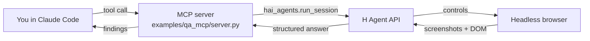

# hai-agent-demos

Recipes for the [`hai-agents`](https://pypi.org/project/hai-agents/) Python SDK, wired up as **MCP servers and CLI tools for Claude Code**. Each example shows one way to use the SDK in a real workflow.

## What is this?

The `hai-agents` SDK lets you spin up autonomous agents — web-surfing, code-running, vision-capable — and drive them from Python. This repo wraps that SDK into two interface patterns so you can call the agents from inside Claude Code while you work:

- **MCP server** — Claude Code calls the agent like any other MCP tool
- **CLI + Claude Code skill** — Claude Code runs a shell command that the `qa-via-cli` skill knows how to invoke

Each example also demonstrates a different *recipe* on top of the SDK:

- [`qa_mcp`](examples/qa_mcp/) / [`qa_cli`](examples/qa_cli/): **single-task pattern** — wrap one agent task as one tool/command.
- [`mcpify_anything`](examples/mcpify_anything/): **typed-toolkit pattern** — declare a family of typed tools with one decorator and a shared runner.

## Quickstart

```bash
git clone <this-repo>
cd hai-agent-demos
uv sync
cp .env.example .env  # add your H_API_KEY from https://platform.hcompany.ai/settings/api-keys
claude                 # opens Claude Code in the repo; the MCP server is auto-registered
```

In Claude Code:

> *"Use `review_web_ui` to check https://news.ycombinator.com — verify the top story link works and the page has reasonable accessibility."*

## Examples

| Example | What it shows | Interface |
| --- | --- | --- |
| [`qa_mcp`](examples/qa_mcp/) | Autonomous browser agent QAs a remote URL and returns structured `{verdict, summary, findings}` | MCP server (`review_web_ui`, `visual_check`) |
| [`qa_cli`](examples/qa_cli/) | Same QA agent exposed as a shell command, surfaced to Claude Code via the `qa-via-cli` skill | CLI (`qa-cli review / visual`) |
| [`mcpify_anything`](examples/mcpify_anything/) | Turn any website into typed MCP tools: declare input/output as Pydantic models plus a one-line prompt, and a cloud browser agent fills the contract with schema-validated JSON | MCP server (`get_product_prices`, `add_cart_items`, `extract`) |

## How it works



The MCP server is a thin FastMCP wrapper around `hai_agents.run_session`. Each tool defines an inline agent (with a browser environment and shared skills), submits the user's instruction, and surfaces the structured answer back to Claude Code.

Shared components (agent instructions, `ReviewResult` model, helpers) live in [`examples/_shared.py`](examples/_shared.py) and are imported by both `qa_mcp` and `qa_cli`.

## Configuration

| Env var | Required | Source |
| --- | --- | --- |
| `H_API_KEY` | yes | https://platform.hcompany.ai/settings/api-keys |

## Project layout

```
hai-agent-demos/
├── .mcp.json                      # registers MCP servers with Claude Code
├── .claude/skills/qa-via-cli/     # Claude Code skill for invoking qa-cli
├── examples/
│   ├── _shared.py                 # shared instructions, models, and helpers (qa_*)
│   ├── agent_skills/              # skill docs passed to the ui-reviewer agent
│   ├── qa_mcp/                    # MCP server (review_web_ui + visual_check)
│   ├── qa_cli/                    # CLI wrapper (qa-cli review / visual)
│   └── mcpify_anything/           # typed-toolkit MCP server (3 example tools)
├── AGENTS.md                      # coding rules for contributors
└── pyproject.toml
```

## Links

- [hai-agents on PyPI](https://pypi.org/project/hai-agents/)
- [H Company Platform](https://platform.hcompany.ai)
- [Model Context Protocol](https://modelcontextprotocol.io)
