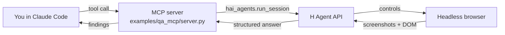

# hai-agent-demos

Recipes for the [`hai-agents`](https://pypi.org/project/hai-agents/) Python SDK, wired up as **MCP servers and CLI tools for Claude Code**. Each example shows one way to use the SDK in a real workflow.

## What is this?

The `hai-agents` SDK lets you spin up autonomous agents — web-surfing, code-running, vision-capable — and drive them from Python. This repo wraps that SDK into two interface patterns so you can call the agents from inside Claude Code while you work:

- **MCP server** — Claude Code calls the agent like any other MCP tool
- **CLI + Claude Code skill** — Claude Code runs a shell command that the `qa-via-cli` skill knows how to invoke

Each example also demonstrates a different *recipe* on top of the SDK:

- [`qa_mcp`](examples/qa_mcp/) / [`qa_cli`](examples/qa_cli/): **single-task pattern** — wrap one agent task as one tool/command.
- [`mcpify_anything`](examples/mcpify_anything/): **typed-toolkit pattern** — declare a family of typed tools with one decorator and a shared runner.
- [`counterfeit_detection`](examples/counterfeit_detection/): **single-agent + custom-tools pattern** — upgrade one agent with local Python tools (Playwright screenshots, Holo visual compare) and a step/time budget, no orchestration.

## Quickstart

```bash
git clone <this-repo>
cd hai-agent-demos
uv sync
cp .env.example .env  # add your H_API_KEY from https://platform.hcompany.ai/settings/api-keys
claude                 # opens Claude Code in the repo; the MCP server is auto-registered
```

In Claude Code:

> *"Use `review_web_ui` to check https://news.ycombinator.com — verify the top story link works and the page has reasonable accessibility."*

## Examples

| Example | What it shows | Interface |
| --- | --- | --- |
| [`qa_mcp`](examples/qa_mcp/) | Autonomous browser agent QAs a remote URL and returns structured `{verdict, summary, findings}` | MCP server (`review_web_ui`, `visual_check`) |
| [`qa_cli`](examples/qa_cli/) | Same QA agent exposed as a shell command, surfaced to Claude Code via the `qa-via-cli` skill | CLI (`qa-cli review / visual`) |
| [`mcpify_anything`](examples/mcpify_anything/) | Turn any website into typed MCP tools: declare input/output as Pydantic models plus a one-line prompt, and a cloud browser agent fills the contract with schema-validated JSON | MCP server (`get_product_prices`, `add_cart_items`, `extract`) |
| [`counterfeit_detection`](examples/counterfeit_detection/) | Three-stage cookbook: a bare `run_session` finds one counterfeit of a genuine product; local custom tools add screenshot-grounded visual verdicts; a `max_steps`/`max_time_s` budget turns it into an exhaustive sweep | CLI (`counterfeit-cli simple / tooled / sweep`) |

## How it works



The MCP server is a thin FastMCP wrapper around `hai_agents.run_session`. Each tool defines an inline agent (with a browser environment and shared skills), submits the user's instruction, and surfaces the structured answer back to Claude Code.

Shared components (agent instructions, `ReviewResult` model, helpers) live in [`examples/_shared.py`](examples/_shared.py) and are imported by both `qa_mcp` and `qa_cli`.

## Configuration

| Env var | Required | Source |
| --- | --- | --- |
| `H_API_KEY` | yes | auto-setup via `python3 skills/hcompany-platform/scripts/h_login.py`, or manually from https://platform.hcompany.ai/settings/api-keys |

## Skills & plugin marketplace

[Agent Skills](https://docs.claude.com/en/docs/agents-and-tools/agent-skills/overview) are folders of instructions, scripts, and resources that Claude loads dynamically to improve performance on specialized tasks. Each skill is a directory under [`skills/`](skills/) containing a `SKILL.md` with YAML frontmatter (`name`, `description`) followed by the instructions Claude follows when the skill is active — same layout as [anthropics/skills](https://github.com/anthropics/skills).

This repo doubles as a **Claude Code plugin marketplace** ([`.claude-plugin/marketplace.json`](.claude-plugin/marketplace.json)): each skill is published as a plugin under the `hcompany-skills` marketplace, so anyone can install them into their own Claude Code without cloning the repo.

### Available skills

| Skill | What Claude learns | Pairs with |
| --- | --- | --- |
| [`hcompany-platform`](skills/hcompany-platform/) | The H Company APIs end-to-end: portal (auth, orgs, API keys + the automated `H_API_KEY` → `.env` login script), agent platform v2 (sessions, agents, environments, vaults, long-polling), the hai-agents Python/TS SDKs, and the agent-view run-replay workflow | any project calling the H Company platform |
| [`qa-via-cli`](skills/qa-via-cli/) | When and how to invoke `qa-cli review` / `qa-cli visual` to QA a live web page and surface the structured findings | the [`qa_cli`](examples/qa_cli/) example in this repo |

### Install in Claude Code

In any Claude Code session:

```
/plugin marketplace add hcompai/hai-agent-demos      # or a local clone path
/plugin install hcompany-platform@hcompany-skills
/plugin install qa-via-cli@hcompany-skills
```

Once installed, the skills trigger automatically when a conversation matches their `description` — e.g. asking about H Company sessions or API keys pulls in `hcompany-platform`.

### Use elsewhere

- **claude.ai** (paid plans): upload a skill folder (e.g. `skills/hcompany-platform/`) via Settings → Skills.
- **Claude API**: attach the skill files to your agent following the [Agent Skills docs](https://docs.claude.com/en/docs/agents-and-tools/agent-skills/overview).

### Add a new skill

1. Create `skills/<your-skill>/SKILL.md` with `name` and `description` frontmatter (keep the description specific — it's what triggers the skill).
2. Add reference docs or scripts alongside it as needed (see `hcompany-platform/references/` for the pattern).
3. Register it as a plugin entry in [`.claude-plugin/marketplace.json`](.claude-plugin/marketplace.json).

## Project layout

```
hai-agent-demos/
├── .claude-plugin/marketplace.json # Claude Code plugin marketplace (skills below)
├── skills/
│   ├── hcompany-platform/         # H Company APIs skill (portal + agp + SDKs)
│   └── qa-via-cli/                # skill for invoking qa-cli
├── .mcp.json                      # registers MCP servers with Claude Code
├── examples/
│   ├── _shared.py                 # shared instructions, models, and helpers (qa_*)
│   ├── agent_skills/              # skill docs passed to the ui-reviewer agent
│   ├── qa_mcp/                    # MCP server (review_web_ui + visual_check)
│   ├── qa_cli/                    # CLI wrapper (qa-cli review / visual)
│   ├── mcpify_anything/           # typed-toolkit MCP server (3 example tools)
│   └── counterfeit_detection/     # cookbook CLI (counterfeit-cli simple / tooled / sweep)
├── AGENTS.md                      # coding rules for contributors
└── pyproject.toml
```

## Links

- [hai-agents on PyPI](https://pypi.org/project/hai-agents/)
- [H Company Platform](https://platform.hcompany.ai)
- [Model Context Protocol](https://modelcontextprotocol.io)
