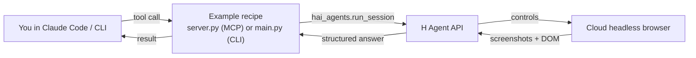

# Examples

Each subdirectory is one self-contained recipe for the `hai-agents` SDK.

| Example | What it shows |
| --- | --- |
| [`qa/mcp`](qa/mcp/) | Run an autonomous browser agent against a remote URL to QA a web UI; expose it to Claude Code as an MCP server. |
| [`qa/cli`](qa/cli/) | Same QA agent, exposed as a shell command (`qa-cli`) and surfaced to Claude via the `hai-qa-via-cli` skill instead of MCP. |
| [`extract_anything`](extract_anything/) | One tool exposed two ways. MCP: `extract(url, task, schema)`. CLI: `extract-cli picture`. The cloud browser agent reads the page visually (Wikipedia's Picture of the Day in the CLI demo) and returns JSON matching the schema. |
| [`counterfeit_detection`](counterfeit_detection/) | Cookbook for the single-agent + custom-tools pattern: find counterfeit listings of a genuine product. Three stages — a bare `run_session`, then local Playwright/Holo screenshot-compare tools, then a `max_steps`/`max_time_s` budget that turns "find one" into "find as many as the budget allows". |

## How it works

Every recipe is a thin wrapper around `hai_agents.run_session`. It defines an inline agent (a browser environment plus, usually, an `answer_format` that constrains the reply to a JSON schema), submits the user's instruction, and surfaces the structured answer back to Claude Code or the shell — no agent template to pre-register.

## Shared code

- [`_shared.py`](_shared.py) — generic helpers reused across recipes: `browser_env`, API-key check, logging/printing utilities.
- [`qa/shared.py`](qa/shared.py) — QA-specific bits: the reviewer instructions, the `ReviewResult` model, and the agent-skill loader. Imported by both [`qa/mcp`](qa/mcp/) and [`qa/cli`](qa/cli/).

## Add an example

Create a new subdirectory with a `server.py` (MCP) or `main.py` (CLI), a short `README.md`, and a console-script entry in the root `pyproject.toml`. MCP servers additionally need a one-line entry in the root `.mcp.json` so Claude Code auto-registers them.
