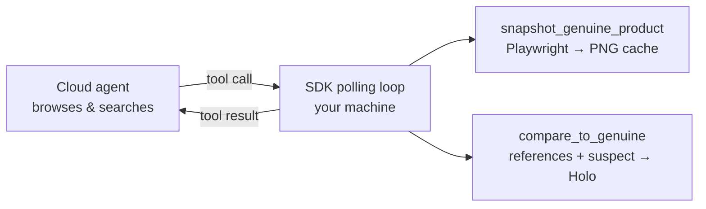

# `counterfeit_detection` — one agent, one task, three stages

Give one agent the URL of a genuine product; get back counterfeit listing URL(s), or `null`. No orchestration, no workflow engine — one `run_session` call, then two upgrades that make the same agent dramatically better at the job.

| Stage | Command | What changes |
| --- | --- | --- |
| 1. Just ask | `counterfeit-cli simple` | One `run_session` call. Finds **one** counterfeit, stops. |
| 2. Give it eyes | `counterfeit-cli tooled` | Two **local custom tools**: snapshot the genuine product, get a Holo visual verdict on every suspect before answering. |
| 3. Budget as fuel | `counterfeit-cli sweep` | `max_steps`/`max_time_s` flip the goal: find **as many** as the budget allows, streaming each finding out as it's confirmed. |

## Run

```bash
uv sync && uv run playwright install chromium    # chromium: one-time, for the local screenshot tool
cp .env.example .env                             # add HAI_API_KEY

uv run counterfeit-cli simple --genuine-url "https://www.<brand>.com/<product-page>"
uv run counterfeit-cli tooled --genuine-url "https://www.<brand>.com/<product-page>"
uv run counterfeit-cli sweep  --genuine-url "https://www.<brand>.com/<product-page>" --max-steps 80
```

JSON result on stdout, progress on stderr. Expect ~7 / ~11 / ~12 minutes per stage; watch the session live at [platform.hcompany.ai](https://platform.hcompany.ai).

## Stage 1 — just ask

An inline agent whose cloud browser boots on the genuine page, a strict answer schema, one call:

```python
result = run_session(
    client,
    agent=Agent(
        name="counterfeit-spotter",
        instructions=SIMPLE_INSTRUCTIONS,                      # persona + rules + safety
        environments=[browser_env(genuine_url)],               # browser starts on the genuine page
        answer_format=CounterfeitFinding.model_json_schema(),  # {counterfeit_url, confidence, red_flags, reasoning, product_info}
    ),
    messages=f"Find one counterfeit listing of the genuine product at {genuine_url}.",
)
```

It works — but ten searches deep, the genuine page has scrolled out of the agent's visual context. Its "looks fake" judgment compares against a **memory** of the product. Confidence is vibes.

## Stage 2 — give it eyes

Not a second agent — two **custom tools**: plain Python functions that run on *your* machine while the agent browses in the cloud. The signature + docstring is the whole contract; pass them via `run_session(tools=[...])`.

```python
@tool(name="snapshot_genuine_product")
def snapshot_genuine_product(url: str, label: str) -> str:
    """Cache a reference screenshot of the GENUINE product page. Call 1-3 times at the start."""

@tool(name="compare_to_genuine")
def compare_to_genuine(suspect_url: str, note: str = "") -> str:
    """Render the suspect locally, ask Holo for a verdict against the cached references."""
    # → "LIKELY_COUNTERFEIT: logo proportions off; price 92% below retail"
```



Now every answer carries a grounded visual verdict instead of a recollection. (When a suspect site bot-walls the local render, the tool says so — `INCONCLUSIVE` — and the agent downgrades its confidence accordingly. Observed live.)

## Stage 3 — budget as fuel

`run_session` takes a real budget: `max_steps` and `max_time_s`. With one, flip the objective — *spend it all, enumerate everything*. A third tool streams each confirmed finding out of the session immediately, so nothing is lost when the budget trips:

```python
@tool(name="record_counterfeit")
def record_counterfeit(url: str, confidence: str, compare_verdict: str, red_flags: list[str], reasoning: str) -> str:
    """Stream one confirmed counterfeit to the local results list, then keep searching."""

result = run_session(client, agent=..., tools=[snapshot, compare, record], max_steps=80, max_time_s=1200.0)
print(json.dumps({"findings": log.items}))   # the local log is the output — even after a timeout
```

The agent's final answer is just a count + why it stopped; the local `FindingsLog` is the source of truth. Not a style choice: in live runs the agent claimed 9 recorded findings while the log held 4 distinct URLs — it counted listings it had *seen*, not calls that landed. Trust the log.

## Files

[`main.py`](main.py) — the 3-stage tyro CLI · [`local_tools.py`](local_tools.py) — the custom tools · [`prompts.py`](prompts.py) — per-stage instructions

## Responsible use

Written for **rights holders and brand-protection teams** investigating counterfeits of their own products. The agent never purchases, never creates accounts, never submits forms. Findings are takedown leads, not verdicts — have a human verify before acting.
