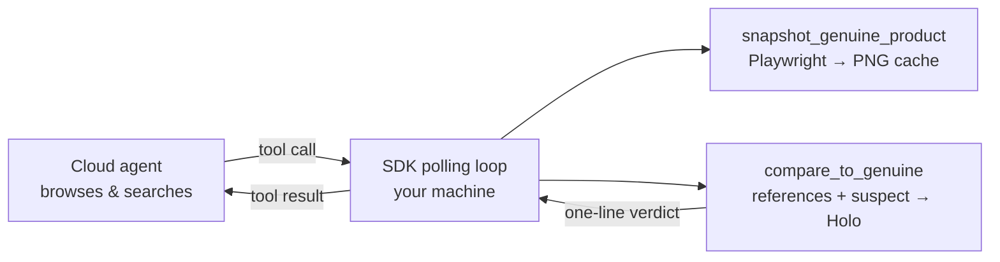

# `counterfeit_detection` — one agent, one task, three stages

A cookbook for the **single-agent + custom-tools pattern**: give one agent the URL of a genuine product, get back the URL of a counterfeit listing (or `null`). No multi-agent orchestration, no workflow engine — just `run_session`, then two upgrades that make the same agent dramatically better at the job.

| Stage | Command | What changes |
| --- | --- | --- |
| 1. Just ask | `counterfeit-cli simple` | One `run_session` call. Finds **one** counterfeit and stops. |
| 2. Give it eyes | `counterfeit-cli tooled` | Two local custom tools: cache reference screenshots of the genuine product, get a Holo visual verdict on every suspect **before** answering. |
| 3. Budget as fuel | `counterfeit-cli sweep` | `max_steps` + `max_time_s` become the strategy: enumerate **as many** counterfeits as the budget allows, streaming each finding out as it's confirmed. |

## Run

```bash
cd agent-sdk-demo
uv sync
uv run playwright install chromium   # one-time, for the stage 2/3 local screenshot tool
cp .env.example .env                 # add H_API_KEY

uv run counterfeit-cli simple --genuine-url "https://www.<brand>.com/<product-page>"
uv run counterfeit-cli tooled --genuine-url "https://www.<brand>.com/<product-page>"
uv run counterfeit-cli sweep  --genuine-url "https://www.<brand>.com/<product-page>" --max-steps 80 --max-time-s 1200
```

Progress goes to stderr, the JSON result to stdout. Watch the live session at [platform.hcompany.ai](https://platform.hcompany.ai) while it runs.

## Stage 1 — just ask

The smallest thing that works: an inline agent whose browser boots on the genuine product page, a strict answer schema, one call.

```python
result = run_session(
    client,
    agent={
        "name": "counterfeit-spotter",
        "instructions": SIMPLE_INSTRUCTIONS,                       # persona + what counts as a counterfeit + safety rules
        "environments": [browser_env(genuine_url)],                # cloud browser starts on the genuine page
        "answer_format": CounterfeitFinding.model_json_schema(),   # {counterfeit_url, confidence, red_flags, reasoning}
    },
    messages=f"Find one counterfeit listing of the genuine product at {genuine_url}.",
)
```

This works — and you should run it first to see *how* it works. Then look closely at the `reasoning` field of a few runs and you'll spot the weakness: by the time the agent is ten searches deep into replica sites, the genuine product page has long scrolled out of its visual context. Its "this looks like a fake" judgment is a comparison against a **memory** of the genuine product, not the product. Confidence is vibes.

## Stage 2 — give it eyes

The fix is not a second agent. It's two **custom tools** — plain Python functions that run on *your* machine while the agent browses in the cloud. Pass them to `run_session(tools=[...])` and the SDK's polling loop executes each call locally and posts the result back into the session:

```python
@tool(name="snapshot_genuine_product")
def snapshot_genuine_product(url: str, label: str) -> str:
    """Cache a reference screenshot of the GENUINE product page. Call 1-3 times at the start."""
    # Playwright renders the page locally → PNG cached on disk

@tool(name="compare_to_genuine")
def compare_to_genuine(suspect_url: str, note: str = "") -> str:
    """Render the suspect locally, ask Holo for a side-by-side verdict against the cached references."""
    # → "LIKELY_COUNTERFEIT: logo proportions off; stitching irregular; price 92% below retail"
```

The input schema is derived from the function signature — a typed signature plus a docstring is the whole contract. The instructions then pin the protocol: snapshot the genuine product 2-3 times **first**, and never commit to a suspect without a `compare_to_genuine` verdict of `LIKELY_COUNTERFEIT` or stronger.



Now every answer carries a grounded visual verdict instead of a recollection. Same agent, same task — better evidence.

## Stage 3 — budget as fuel

`run_session` accepts a real budget: `max_steps` (decision cycles) and `max_time_s` (wall clock). Without one, "find one and stop" is the right task shape. **With** one, you can flip the objective: *spend the whole budget, enumerate everything you can find.*

That raises a new problem — if the budget trips mid-search, a final answer listing all findings never gets written. So stage 3 adds a third tool that streams findings out of the session the moment each one is confirmed:

```python
@tool(name="record_counterfeit")
def record_counterfeit(url: str, confidence: str, compare_verdict: str, red_flags: list[str], reasoning: str) -> str:
    """Stream one confirmed counterfeit to the local results list, then keep searching."""
```

```python
result = run_session(
    client,
    agent={..., "answer_format": SweepSummary.model_json_schema()},   # the final answer is just a count + why it stopped
    messages=f"Find as many distinct counterfeit listings as you can of {genuine_url} ...",
    tools=[snapshot_genuine_product, compare_to_genuine, record_counterfeit],
    max_steps=80,
    max_time_s=1200.0,
)
print(json.dumps({"findings": log.items, ...}))       # the real output lives in the local log
```

Even a `timed_out` session returns a full findings list — nothing confirmed is ever lost. The agent's final answer is demoted to a one-line summary (`recorded_count`, `stopped_reason`); the local `FindingsLog` is the source of truth. That last part is not a stylistic choice: in live runs the agent's self-reported count drifts from reality (one budget-exhausted sweep claimed 9 recorded findings while the log held 4 distinct URLs — the model counted listings it had *seen*, not calls that landed). Trust the log, print the log.

## Files

| File | What it is |
| --- | --- |
| [`main.py`](main.py) | The three-stage tyro CLI (`simple` / `tooled` / `sweep`). |
| [`local_tools.py`](local_tools.py) | The custom tools: Playwright snapshots, Holo visual compare, findings stream. |
| [`prompts.py`](prompts.py) | Shared ground rules + per-stage instructions. |

## Responsible use

This recipe is written for **rights holders and brand-protection teams** investigating counterfeits of their own products. The agent is instructed to never purchase, never create accounts, never submit forms — it only locates and documents listings. Findings are leads for a takedown process, not verdicts; have a human verify before acting on them.
