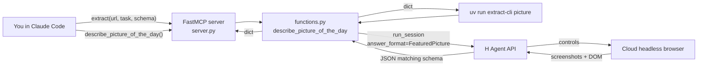

# `extract_anything` — agent calls as deterministic functions

This example shows the abstraction the SDK doesn't ship on its own: **wrap an agent call in a typed Python function** with fixed prompt, fixed inputs, and fixed output schema — then call it like any other function, 1 time or 1000, without re-prompting. MCP is one optional surface; plain Python imports work just as well.

Two shapes ship in this folder:

Two shapes ship in this folder, and the MCP server exposes both:

- **Generic** — `extract(url, task, answer_schema)` lets the caller hand the schema in at call time. Useful when the shape is the caller's business (and the same primitive QA/agent platforms expose).
- **Specific** — `describe_picture_of_the_day()` is a zero-arg deterministic tool: fixed prompt, fixed schema, every call returns a `FeaturedPicture`. This is the shape most production code wants — `get_flights(date, origin, dest) -> FlightList`, `fill_form(name, age, ...) -> Receipt`, `describe_picture_of_the_day() -> FeaturedPicture`.

The deterministic function itself lives in [`functions.py`](functions.py) and is imported by both `server.py` (MCP tool surface) and `cli.py` (CLI subcommand surface) — same function, two surfaces. Where [`qa/mcp`](../qa/mcp/) shows wrapping *one fixed task* as one tool, this shows the pattern that turns any agent call into a function, generic or specific, MCP or in-process.

## The tools

```python
extract(url: str, task: str, answer_schema: dict) -> dict   # generic
describe_picture_of_the_day() -> FeaturedPicture            # specific
```

`extract` is the generic primitive — read [`server.py`](server.py) for the ~20 lines that wire an `Agent`, call `run_session`, and return `result.answer`.

`describe_picture_of_the_day` is the specific primitive: zero args, fixed schema. Its body in `server.py` is two lines — it delegates to the Python function in [`functions.py`](functions.py). The same function is the engine behind `uv run extract-cli picture`, so the CLI and MCP surfaces stay in sync without copy-pasting prompts or schemas.

## Run

```bash
cd hai-agent-demos
uv sync
cp .env.example .env  # add H_API_KEY
hai-agent-demos-extract-anything   # MCP server over stdio (Claude Code auto-registers via .mcp.json)
```

In Claude Code, either tool works:

> *"Call `describe_picture_of_the_day` — no args."*

…or, for the generic shape:

> *"Use `extract` on https://en.wikipedia.org/wiki/Main_Page — task: `find the Picture of the Day section, look at the image, and describe what is in it in your own words; also transcribe any text inside the image and read the credit`, answer_schema: `{"type":"object","properties":{"title":{"type":"string"},"image_description":{"type":"string"},"visible_text_in_image":{"type":"string"},"credit":{"type":"string"}},"required":["title","image_description","credit"]}`."*

Prefer a shell? The deterministic function is also wired up as a CLI:

```bash
uv run extract-cli picture
```

`cli.py` is the place to look for what the function shape looks like when the agent is fully hidden behind a typed signature — the showcase here is Wikipedia's *Picture of the Day* (the answer lives in pixels, not the DOM).

## Layout

```
extract_anything/
├── functions.py # the deterministic function: `describe_picture_of_the_day(client) -> dict`
├── server.py    # MCP surface: generic `extract` tool + thin `describe_picture_of_the_day` wrapper
├── cli.py       # CLI surface: `picture` subcommand calling the same function with a live event tail
├── prompts/
│   └── extractor_instructions.md   # operator instructions shared by every variant
└── README.md
```

## How it works



## Configuration

| Env var | Required | Source |
| --- | --- | --- |
| `H_API_KEY` | yes | https://platform.hcompany.ai/settings/api-keys |
