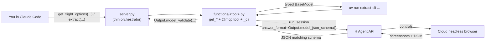

# `extract_anything` — agent calls as deterministic functions

This example shows the abstraction the SDK doesn't ship on its own: **wrap an agent call in a typed Python function** with fixed prompt, typed Pydantic inputs, and a typed Pydantic output model — then call it like any other function, 1 time or 1000, without re-prompting. MCP is one optional surface; plain Python imports work just as well.

Two shapes ship in this folder, and the MCP server exposes both:

- **Generic** — `extract(site, task, answer_schema)` lets the caller hand the schema in at call time. Useful when the shape is the caller's business.
- **Specific** — a curated set of typed `get_*` functions (`get_flight_options`, `get_apartment_listings`, `get_recent_posts`, …): fixed prompts, fixed schemas, each returns its own Pydantic model. This is the shape most production code wants — `get_flight_options(...) -> FlightOptions`, `get_recent_posts(...) -> RecentPosts`. The return type **is** the contract; the agent is an implementation detail.

Each tool lives in [`functions/`](functions/), and each file owns all three surfaces for that tool: the typed Python function, the `@mcp.tool` wrapper, and the CLI subcommand. `server.py` and `cli.py` become tiny orchestrators — importing the `functions` package triggers every `@mcp.tool` registration as a side effect, and the package aggregates each module's `CLI_NAME`/`CLI_FN` into one dict that tyro dispatches. Where [`qa/mcp`](../qa/mcp/) shows wrapping *one fixed task* as one tool, this shows the pattern that turns any agent call into a function, generic or specific, MCP or in-process.

## The tools

| Tool | Returns | What it does |
| --- | --- | --- |
| `extract` | `dict` | Caller-supplied JSON Schema — escape hatch for one-offs. |
| `describe_picture_of_the_day` | `FeaturedPicture` | Vision-only: describes Wikipedia's *Picture of the Day* by looking at the embedded image. |
| `get_apartment_listings` | `ApartmentListings` | Rental search on a real-estate site, filtered by city / beds / rent. |
| `get_appointment_slots` | `AppointmentSlots` | Available slots on a booking site for a service + location. |
| `get_catalog_table` | `CatalogTable` | Read every row of a product-catalog HTML table. |
| `get_flight_options` | `FlightOptions` | One-way fares for a route on a date. |
| `get_job_listings` | `JobListings` | Postings matching a role family in a location. |
| `get_marketplace_listings` | `MarketplaceListings` | Classifieds search by query / location / max price. |
| `get_product_prices` | `ProductPrices` | Shopping-site search; mixes agent-read products with a client-stamped `captured_at`. |
| `get_products_infinite_scroll` | `ScrolledProducts` | Scroll a lazy-loaded page until N items load, then read them. |
| `get_recent_posts` | `RecentPosts` | Most-recent posts on a social profile/account. |

Read any single file in [`functions/`](functions/) top-to-bottom to see one tool end-to-end — output model, the Python function, the `@mcp.tool` wrapper, and the CLI subcommand all in one place.

### Why not login or actions

Two categories from the OG mcpify-anything are deliberately excluded here: tools that submit credentials (`get_products_after_login`), and tools that mutate state on the page (`add_cart_items`, `configure_product`). The browser this MCP server drives is a *cloud* browser — sending passwords or triggering checkout-style actions over that wire isn't appropriate for a public demo. The pattern is the same; only the safe-to-demo tools are included.

## Run

```bash
uv sync
cp .env.example .env                            # add HAI_API_KEY

uv run hai-agent-demos-extract-anything         # MCP server over stdio (Claude Code auto-registers via .mcp.json)
```

In Claude Code, any of the curated tools works:

> *"Call `get_flight_options` — site `https://www.kayak.com`, origin `SFO`, destination `JFK`, depart_date `2026-07-04`, max_results `5`."*

…or the generic shape, when you need a custom schema:

> *"Use `extract` on https://en.wikipedia.org/wiki/Main_Page — task: `find the Picture of the Day section, look at the image, and describe what is in it in your own words; also transcribe any text inside the image and read the credit`, answer_schema: `{"type":"object","properties":{"title":{"type":"string"},"image_description":{"type":"string"},"visible_text_in_image":{"type":"string"},"credit":{"type":"string"}},"required":["title","image_description","credit"]}`."*

Prefer a shell? Every function is wired up as a CLI subcommand — tyro derives the flags from each function's signature:

```bash
uv run extract-cli                       # list all subcommands
uv run extract-cli flight-options --help # flags for one tool
uv run extract-cli picture               # vision-only demo, live event tail
uv run extract-cli recent-posts --site https://x.com --account elonmusk --max-results 10
```

`picture` uses the streaming runner (live event tail — the showcase demo); the other subcommands show a spinner while the agent works and print the typed JSON result on completion.

Or call them directly from Python:

```python
from hai_agents import Client
from examples.extract_anything import functions

result = functions.get_flight_options(
    Client(api_key="..."),
    site="https://www.kayak.com",
    origin="SFO",
    destination="JFK",
    depart_date=date(2026, 7, 4),
    max_results=5,
)
print(result.options[0].price)   # typed BaseModel, not dict
```

## Layout

```
extract_anything/
├── functions/                     # one file per tool — each owns its function + @mcp.tool + _cli subcommand
│   ├── __init__.py                # imports every tool module (triggers @mcp.tool registrations); aggregates CLI_SUBCOMMANDS
│   ├── _common.py                 # mcp instance, lazy get_client, Price, parse_answer, run_extraction, run_cli, url
│   ├── extract.py                 # generic escape-hatch
│   ├── picture.py                 # describe_picture_of_the_day -> FeaturedPicture (CLI keeps streaming for live event tail)
│   ├── apartment_listings.py
│   ├── appointment_slots.py
│   ├── catalog_table.py
│   ├── flight_options.py
│   ├── job_listings.py
│   ├── marketplace_listings.py
│   ├── product_prices.py
│   ├── products_infinite_scroll.py
│   └── recent_posts.py
├── prompts/
│   └── extractor_instructions.md  # universal operator preamble: report what's shown, don't invent, no markdown
├── server.py                      # ~25 lines — imports functions package (triggers registrations) and runs mcp
├── cli.py                         # ~30 lines — load_dotenv + tyro dispatch over CLI_SUBCOMMANDS
└── README.md
```

## How it works



## Configuration

| Env var | Required | Source |
| --- | --- | --- |
| `HAI_API_KEY` | yes | https://platform.hcompany.ai/settings/api-keys |
